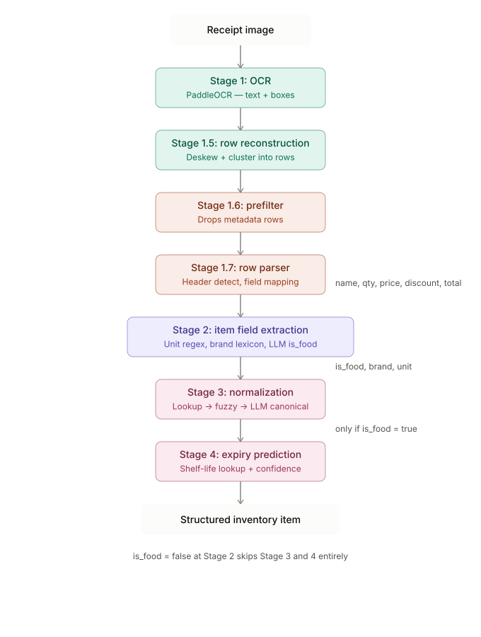

# Architecture.md — High-Level System Design

## Smart-Stock

**Version:** 2.0 — NER retired, replaced by row-parser + item field extraction (see ML_Pipeline.md for full rationale)

---

## 1. System Overview

Smart-Stock is a full-stack web application with an embedded ML pipeline. The system is composed of four primary layers:

1. **React Frontend** — User-facing dashboard and upload interface
2. **FastAPI Backend** — Business logic, orchestration, scheduling
3. **ML Pipeline** — OCR → Row Reconstruction → Prefilter → Row Parser → Item Field Extraction → Normalization → Expiry Prediction
4. **PostgreSQL Database** — Persistent storage for inventory, shelf-life data, alerts

---

## 2. High-Level Architecture Diagram

```
┌─────────────────────────────────────────────────────────────────────┐
│                          CLIENT LAYER                               │
│                                                                     │
│   ┌──────────────────────────────────────────────────────────┐      │
│   │              React + TypeScript (Vite)                   │      │
│   │                                                          │      │
│   │  ┌────────────┐  ┌──────────────┐  ┌─────────────────┐   │      │
│   │  │  Receipt   │  │   Virtual    │  │   Waste / Alert │   │      │
│   │  │  Upload UI │  │  Fridge View │  │   Dashboard     │   │      │
│   │  └────────────┘  └──────────────┘  └─────────────────┘   │      │
│   └──────────────────────────┬───────────────────────────────┘      │
└──────────────────────────────│──────────────────────────────────────┘
                               │  HTTPS / REST + WebSocket
┌──────────────────────────────▼──────────────────────────────────────┐
│                         API LAYER                                   │
│                                                                     │
│              FastAPI (Python 3.11) + Uvicorn                        │
│                                                                     │
│  ┌──────────────┐  ┌──────────────┐  ┌──────────────────────────┐   │
│  │  /receipts   │  │  /inventory  │  │  /recipes  │  /alerts    │   │
│  │  (upload,    │  │  (CRUD,      │  │  (fetch,   │  (schedule, │   │
│  │   process)   │  │   list)      │  │   suggest) │   dismiss)  │   │
│  └──────┬───────┘  └──────┬───────┘  └──────┬─────┴──────┬──────┘   │
│         │                 │                 │            │          │
└─────────│─────────────────│─────────────────│────────────│──────────┘
          │                 │                 │            │
┌─────────▼─────────────────│─────────────────│────────────│─────────┐
│                    ML PIPELINE LAYER        │            │         │
│                                             │            │         │
│  ┌──────────────────────────────────────┐   │            │         │
│  │            Receipt Image             │   │            │         │
│  │                  │                   │   │            │         │
│  │         ┌────────▼────────┐          │   │            │         │
│  │         │  PaddleOCR      │          │   │            │         │
│  │         │  (pretrained)   │          │   │            │         │
│  │         └────────┬────────┘          │   │            │         │
│  │                  │  text + boxes     │   │            │         │
│  │         ┌────────▼────────┐          │   │            │         │
│  │         │  Row Reconstr.  │          │   │            │         │
│  │         │ (deskew+cluster)│          │   │            │         │
│  │         └────────┬────────┘          │   │            │         │
│  │                  │  logical rows     │   │            │         │
│  │         ┌────────▼────────┐          │   │            │         │
│  │         │  Prefilter      │          │   │            │         │
│  │         │  (drop metadata)│          │   │            │         │
│  │         └────────┬────────┘          │   │            │         │
│  │                  │  item rows        │   │            │         │
│  │         ┌────────▼────────┐          │   │            │         │
│  │         │  Row Parser     │          │   │            │         │
│  │         │  (header-driven)│          │   │            │         │
│  │         └────────┬────────┘          │   │            │         │
│  │                  │  name,qty,price.. │   │            │         │
│  │         ┌────────▼────────┐          │   │            │         │
│  │         │  Item Field     │          │   │            │         │
│  │         │  Extraction     │          │   │            │         │
│  │         │  (unit/brand/   │          │   │            │         │
│  │         │   is_food)      │          │   │            │         │
│  │         └────────┬────────┘          │   │            │         │
│  │                  │  is_food=true only│   │            │         │
│  │         ┌────────▼────────┐          │   │            │         │
│  │         │  Normalization  │          │   │            │         │
│  │         │  Layer          │          │   │            │         │
│  │         └────────┬────────┘          │   │            │         │
│  │                  │  canonical items  │   │            │         │
│  │         ┌────────▼────────┐          │   │            │         │
│  │         │  Expiry Engine  │          │   │            │         │
│  │         │  (rule + ML)    │          │   │            │         │
│  │         └────────┬────────┘          │   │            │         │
│  │                  │  items + expiry   │   │            │         │
│  └──────────────────│───────────────────┘   │            │         │
│                     │                       │            │         │
└─────────────────────│───────────────────────│────────────│─────────┘
                      │                       │            │
┌─────────────────────▼───────────────────────▼────────────▼─────────┐
│                       DATA LAYER                                   │
│                                                                    │
│                     PostgreSQL (via SQLAlchemy)                    │
│                                                                    │
│   ┌──────────┐  ┌──────────────────┐  ┌────────────────────────┐   │
│   │  users   │  │ inventory_items  │  │  shelf_life_reference  │   │
│   └──────────┘  └──────────────────┘  └────────────────────────┘   │
│   ┌──────────┐  ┌──────────────────┐                               │
│   │  alerts  │  │  waste_log       │                               │
│   └──────────┘  └──────────────────┘                               │
└────────────────────────────────────────────────────────────────────┘
                                │
               ┌────────────────▼────────────────┐
               │        External Services        │
               │                                 │
               │  Spoonacular API (recipes)      │
               │  LLM API (is_food gate,         │
               │  Normalization Pass 3)          │
               │  SMTP / Push (notifications)    │
               └─────────────────────────────────┘
```



---

## 3. Module Breakdown

### 3.1 Frontend (React + TypeScript)

| Module            | Responsibility                                                                           |
| ----------------- | ---------------------------------------------------------------------------------------- |
| `ReceiptUpload` | Handles file selection, preview, upload POST, and item confirmation modal                |
| `FridgeView`    | Renders inventory grid with category grouping, expiry color-coding, sort/filter controls |
| `ItemCard`      | Individual item display: name, qty, expiry bar, CRUD actions, "Cook with this" button    |
| `AlertPanel`    | Displays active expiry alerts, links to recipe view                                      |
| `RecipeModal`   | Shows fetched recipes for at-risk ingredients; "Mark as Cooked" action                   |
| `WasteTracker`  | Visualizes CONSUMED vs WASTED ratios over time (Recharts)                                |
| `AuthContext`   | JWT token storage, login/logout, route guards                                            |

**State Management:** React Query for server state, Zustand for local UI state.

**Confirmation modal note:** items with `is_food: false` are surfaced (not silently dropped) with a "detected but excluded — not a food item" indicator, so the user can see what was filtered and why. See API_Spec.md §2.

### 3.2 Backend (FastAPI)

| Module                      | Responsibility                                                    |
| ---------------------------- | ------------------------------------------------------------------ |
| `routers/receipts.py`       | Receipt upload endpoint; orchestrates ML pipeline call            |
| `routers/inventory.py`      | Full CRUD for inventory items                                     |
| `routers/recipes.py`        | Proxies Spoonacular API with caching layer                        |
| `routers/alerts.py`         | Alert fetch, creation, and dismissal                              |
| `routers/auth.py`           | JWT-based authentication                                          |
| `services/ml_service.py`    | Loads models, runs the full pipeline (see 3.3)                    |
| `services/scheduler.py`     | APScheduler daily job: scans expiry, creates alerts               |
| `services/spoonacular.py`   | Spoonacular API client with Redis/in-memory cache                 |
| `models/`                   | SQLAlchemy ORM models                                             |
| `schemas/`                  | Pydantic request/response schemas                                 |

### 3.3 ML Pipeline

Detailed in `ML_Pipeline.md`. Summary:

```
Receipt Image
     │
     ▼
PaddleOCR (pretrained PP-OCRv6)  — text + bounding boxes
     │
     ▼
Row Reconstruction — deskew + cluster boxes into logical rows
     │
     ▼
Prefilter — drops metadata rows (GST#, Invoice#, Payments, etc.)
     │
     ▼
Row Parser — header-driven column mapping → {item_name, quantity, price, discount, total}
     │
     ▼
Item Field Extraction — regex unit + brand lexicon + LLM is_food gate
     │  is_food = false → item surfaced to user, skips remaining stages
     ▼
Normalization Layer (fuzzy match + lookup + LLM canonical naming) — is_food = true only
     │  Canonical: {item: "Strawberries", qty: 1, unit: "lb"}
     ▼
Expiry Prediction Engine
     │  {item, storage_type} → predicted_expiry_date, confidence
     ▼
Structured Output → API Response
```

**Retired:** fine-tuned DistilBERT NER. It was trained to tag FOOD/QTY/UNIT/PRICE across full single-line receipt text — a task that no longer exists once Row Parser extracts qty/price/discount/total structurally via detected column headers. See NER_Training.md for the retirement note and preserved historical record.

### 3.4 Database (PostgreSQL)

Detailed in `DB_Schema.md`. Five core tables:

- `users` — authentication and profile
- `inventory_items` — live inventory with expiry metadata (now includes `brand`)
- `shelf_life_reference` — canonical shelf-life lookup per food category
- `alerts` — expiry alert records per user
- `waste_log` — terminal state events (CONSUMED / WASTED)

---

## 4. Data Flow: Receipt Upload

```
User uploads receipt image
        │
        ▼
POST /api/receipts/upload
        │
        ▼
FastAPI saves image to temp storage
        │
        ▼
ml_service.run_pipeline(image_path)
    ├── PaddleOCR extracts text + bounding boxes
    ├── Row reconstruction clusters boxes into logical rows (deskew-corrected)
    ├── Prefilter drops metadata rows
    ├── Row parser maps qty/price/discount/total via detected headers
    ├── Item field extraction: unit (regex), brand (fuzzy lexicon), is_food (LLM gate)
    ├── Normalization maps is_food=true items to canonical names (skipped for is_food=false)
    └── Expiry engine predicts best-before dates (skipped for is_food=false)
        │
        ▼
Returns: List[ExtractedItem] (unconfirmed, includes is_food=false items flagged as excluded)
        │
        ▼
Frontend shows confirmation modal
        │
User confirms / edits / removes items
        │
        ▼
POST /api/inventory/batch-create
        │
        ▼
Items saved to inventory_items table
        │
Image deleted from temp storage
```

---

## 5. Data Flow: Expiry Alert Cycle

```
APScheduler — runs daily @ 08:00 UTC
        │
        ▼
Query: SELECT * FROM inventory_items
       WHERE expiry_date <= NOW() + INTERVAL '48 hours'
       AND status = 'ACTIVE'
        │
        ▼
For each user with at-risk items:
    Create alert record in `alerts` table
    Send in-app notification (WebSocket push)
        │
        ▼
User sees alert → clicks "Get Recipes"
        │
        ▼
GET /api/recipes?ingredients=[list]
        │
        ▼
Check cache → if miss → call Spoonacular API
        │
        ▼
Return ranked recipes
        │
User marks recipe as "Cooked"
        │
        ▼
PATCH /api/inventory/bulk-consume
    → Sets item status = 'CONSUMED' in waste_log
```

---

## 6. Authentication Flow

- **Method:** JWT (JSON Web Tokens) via `python-jose`
- Access token: 30-minute expiry
- Refresh token: 7-day expiry, stored in HttpOnly cookie
- All `/api/*` routes except `/auth/login` and `/auth/register` require `Authorization: Bearer <token>`

---

## 7. Deployment Architecture (Target)

```
┌──────────────────────────────────────────────────────────┐
│                        Render / Railway                  │
│                                                          │
│   ┌─────────────────────┐   ┌──────────────────────┐     │
│   │  FastAPI + ML Models│   │  PostgreSQL (managed)│     │
│   │  (Docker container) │   │                      │     │
│   └─────────────────────┘   └──────────────────────┘     │
└──────────────────────────────────────────────────────────┘

┌──────────────────────────────────────────────────────────┐
│                       Vercel                             │
│              React Frontend (Static Build)               │
└──────────────────────────────────────────────────────────┘
```

**ML Model Hosting:** PaddleOCR runs through its own CPU runtime. No other trained model in the pipeline as of v2.0 — item field extraction and normalization use regex, fuzzy lexicon matching, and LLM API calls (no local model to serve or export). Inference is synchronous for MVP; async job queue (Celery + Redis) added post-MVP for scale.

---

## 8. Key Technical Decisions

| Decision              | Choice                              | Rationale                                                    |
| --------------------- | ------------------------------------ | -------------------------------------------------------------- |
| ML framework          | PaddleOCR + regex/fuzzy/LLM          | PaddleOCR handles OCR; no other trained model needed after row-parser redesign |
| Item field extraction | Regex (unit) + fuzzy lexicon (brand) + LLM (is_food) | Cheaper, no training data required, generalizes better to novel item text than a small fine-tuned classifier — see ML_Pipeline.md §3 for the full analysis |
| API framework          | FastAPI                             | Native async, Pydantic validation, Python for ML co-location |
| Frontend state          | React Query + Zustand               | Server state and UI state separated cleanly                  |
| DB ORM                 | SQLAlchemy 2.0                      | Type-safe, async-compatible                                  |
| Model serialization    | PaddleOCR runtime only              | No fine-tuned model left to export/serve as of v2.0 (DistilBERT NER retired) |
| Receipt image storage  | Temp only (deleted post-processing) | Privacy; no long-term image retention                        |

**Superseded decision (v1.0):** "DistilBERT fine-tuned NER, ONNX-exported for inference" — retired. See ML_Pipeline.md §3 for why, and NER_Training.md for the preserved historical record.
