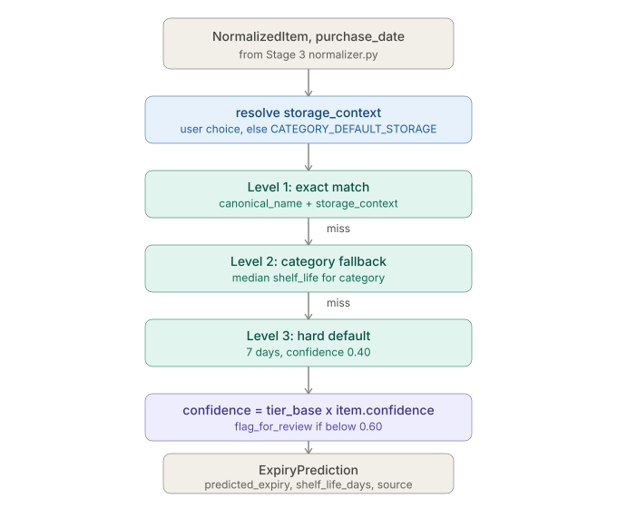

# Expiry.md — Stage 4: Expiry Prediction

**Version:** 3.0 <br>
**Status:** Complete. Core logic was already sound — the real problems were in what it depended on and how it was tested, both fixed this session.

---

## 1. Overview

Stage 4 takes a `NormalizedItem` from Stage 3, plus a storage context and purchase date, and produces a predicted expiry date with a confidence score. That result drives the frontend's dashboard color-coding, alerts, and recipe suggestions.

```
Input  (from Stage 3):   NormalizedItem(canonical_name="Strawberries", category="Produce",
                                          quantity=1.0, unit="lb", normalization_pass=1, confidence=1.0)
                          + storage_context="Fridge"
                          + purchase_date=date(2025, 6, 1)

Output (to inventory):   ExpiryPrediction(predicted_expiry=date(2025, 6, 6),
                                            shelf_life_days=5,
                                            confidence=0.95,
                                            source="exact_match",
                                            flag_for_review=False)
```

Stage 4 is pure logic — no model, no GPU, no checkpoint. It reads the `shelf_life_reference` table (seeded in Stage 3) and computes `purchase_date + shelf_life_days`.

### Why rule-based, not an ML regression model

A trained regression model for shelf life would need a large labeled dataset of `(food item, storage condition, actual expiry date)` triples — data that doesn't exist at the needed granularity in any public dataset. `shelf_life_reference`, built from food safety guidelines, encodes this knowledge directly instead.

The confidence-scoring system gives the frontend what it needs to surface low-confidence predictions for user review — functionally the same outcome a regression model's prediction interval would provide, without requiring training data that doesn't exist.

---

## 2. Where Stage 4 sits in the pipeline



**Contract in:**

| Field | Type | Source |
|---|---|---|
| `item` | `NormalizedItem` | From Stage 3's `normalize_entity()` |
| `purchase_date` | `date` | From the receipt or user input |
| `db` | `Session` | Active SQLAlchemy session |
| `storage_context` | `str \| None` | User-selected, or `None` to use category default |

**Contract out:** `ExpiryPrediction` — never returns `None`; the tiered fallback guarantees *some* answer, down to a hard 7-day default as the last resort.

---

## 3. Module structure

```
ml_service/expiry/
  __init__.py       - makes expiry/ a package so evaluate.py runs as a module
  predictor.py      - core logic, predict_expiry() public entry point
  evaluate.py       - test harness
  data/
    category_default_storage.json
    eval_test_cases.json
```

The `app/` package (`app/models.py`, `app/db.py`) already exists from Stage 3 — no new infra needed here, only a new `InventoryItem` model class added to the existing `app/models.py`.

---

## 4. Storage context resolution

Runs first, before any lookup tier. If the user picked a storage context explicitly, that wins outright. Otherwise, falls back to `CATEGORY_DEFAULT_STORAGE`, keyed by `item.category`.

```
storage_context provided by user?
        | yes                    | no
        v                        v
   use as-is           CATEGORY_DEFAULT_STORAGE[item.category]
                        (defaults to "Fridge" if category is unmapped)
```

This is why Stage 3's category assignment — and specifically the frozen-signal fix (Normalization.md Section 5.6) — matters directly here: an item wrongly categorized as Produce instead of Frozen would default to Fridge storage and get handed a fresh-produce shelf life instead of a frozen one, even though `predict_expiry()` itself has no bug.

---

## 5. The three-tier lookup, in order

### Level 1 — exact match

Looks up `(canonical_name, storage_context)` directly in `shelf_life_reference`.

```python
predict_expiry(item, purchase_date, db)
# item.canonical_name = "Strawberries", storage_context resolved to "Fridge"
# shelf_life_reference has a row for exactly this pair -> hit
```

Base confidence: **0.95**.

### Level 2 — category fallback

Only runs if Level 1 misses. Takes the **median** `shelf_life_days_avg` across every row sharing the same `category` and `storage_context` — not an average, median, so one outlier row (e.g. a long-life canned version of something usually perishable) doesn't skew the whole category.

Base confidence: **0.70**.

### Level 3 — hard default

Only runs if both above miss (no data for this item, and no data for its whole category+storage combination). Returns a flat `DEFAULT_SHELF_LIFE_DAYS = 7`.

Base confidence: **0.40**.

```
Level 1: exact (canonical_name + storage_context)
        | miss
        v
Level 2: category fallback (median across category + storage_context)
        | miss
        v
Level 3: hard default (7 days)
```

---

## 6. Confidence propagation

The final confidence isn't just the tier's base score — it's multiplied by Stage 3's own `NormalizedItem.confidence`, so a shaky Pass 3 LLM match (confidence 0.70 from Normalization.md) drags down the final Stage 4 confidence even on an otherwise-exact shelf-life-table hit.

```
final_confidence = tier_base_confidence * item.confidence
flag_for_review  = final_confidence < 0.60
```

Worked example — an item that resolved via Stage 3 Pass 1 (confidence 1.0) and hit Level 1 here (base 0.95):

```
final_confidence = 0.95 * 1.0 = 0.95   -> not flagged
```

Worked example — an item that resolved via Stage 3 Pass 3 LLM (confidence 0.70) and only hit Level 2 here (base 0.70):

```
final_confidence = 0.70 * 0.70 = 0.49  -> flagged for review (below 0.60)
```

This is a deliberate design choice: uncertainty compounds across stages instead of resetting at each one.

---

## 7. predictor.py output

```python
@dataclass
class ExpiryPrediction:
    predicted_expiry:  date
    shelf_life_days:   int
    confidence:        float
    source:            str   # "exact_match" | "category_fallback" | "hard_default"
    storage_context:   str
    flag_for_review:   bool
```

---

## 8. Data extracted this session

| File | Contents | Was |
|---|---|---|
| `data/category_default_storage.json` | 14 entries, category to default storage context | Inline dict in `predictor.py` |
| `data/eval_test_cases.json` | 16 test cases, item_name + expected days | Inline list of hand-built `NormalizedItem` objects in `evaluate.py` |

`CATEGORY_DEFAULT_STORAGE` is small and stable — genuinely different from Stage 3's growing abbreviation map — but was still moved to a file, for one consistent editing pattern across the codebase rather than two.

---

## 9. Real bug fixed: evaluate.py was not actually an integration test

**This was the more serious finding in this stage — not a data-location issue.**

The original harness hand-constructed `NormalizedItem(...)` objects directly, including manually-chosen `normalization_pass` and `confidence` values, and fed them straight into `predict_expiry()`. It read like a Stage 3+4 integration test but only ever exercised Stage 4 in isolation against fabricated inputs.

**Consequence of the bug:** this test would have passed at 100% even if Stage 3's `normalize_entity()` was completely broken — which, until this session, it was (see Normalization.md's interface rewrite). A green test suite was silently lying about integration coverage.

**Fix:** the harness now calls the real `normalize_entity()` first, using the rewritten `(item_name, quantity, unit, db)` interface, and feeds its actual output into `predict_expiry()`.

```
old:  hand-built NormalizedItem  --------------------->  predict_expiry()  (Stage 3 never touched)
new:  item_name  --> normalize_entity()  -->  real NormalizedItem  -->  predict_expiry()
```

**Side effect:** test cases that specifically exercised Stage 3 confidence propagation (hand-picked Pass 2/3 confidence values like 0.85, 0.91) were removed from this file's test set — they were testing Stage 3's confidence handling, not Stage 4's lookup logic, and putting them back here would mean fabricating `NormalizedItem`s again, undoing the fix. They belong in Normalization.md's own eval instead.

---

## 10. Target metrics

| Metric | Definition | Target |
|---|---|---|
| Accuracy (within 2 days) | % predictions within 2 days of seed reference average | 90% or higher |
| Exact match rate | % items resolved by Level 1 | 75% or higher |
| Category fallback rate | % items falling to Level 2 | 20% or lower |
| Hard default rate | % items hitting Level 3 | 5% or lower |
| MAE (days) | Mean absolute error vs. shelf_life_days_avg in reference | 1.5 days or lower |

**If targets aren't met:**

| Symptom | Action |
|---|---|
| Hard default rate too high | Items hitting Level 3 are missing from `shelf_life_reference` - print their canonical_name, add to the seed data, re-run the seed |
| Exact match rate too low | Canonical name from Stage 3 doesn't match the DB spelling exactly - compare against the DB directly and fix the seed data or the abbreviation map entry so spellings agree |
| MAE too high | Category fallback median is off for a specific category - inspect the category's rows directly and add more representative items to bring the median closer to reality |
| Confidence too low across the board | Stage 3 is resolving too many items via Pass 3 (LLM) - expand the abbreviation map to push more items to Pass 1, raising item.confidence from 0.70 toward 1.00 |

`evaluate.py` usage: `python -m ml_service.expiry.evaluate`.

---

## 11. Real evaluation results (this session — first genuine Stage 3+4 integration run)

16 test cases, run against a live DB, real `normalize_entity()` calls, and the real `shelf_life_reference` table.

| Metric | Result | vs. target |
|---|---|---|
| Total cases | 16 | — |
| Stage 3 resolution failures | 0 | — |
| Exact match (L1) | 15 (93.75%) | Met - target 75% or higher |
| Category fallback (L2) | 1 (6.25%) | Met - target 20% or lower |
| Hard default (L3) | 0 (0%) | Met - target 5% or lower, but see gap below |
| Correct (within +/-2 days) | 16 / 16 = **100%** | Met - target 90% or higher |
| Avg confidence | 0.934 | — |
| Flagged for review | 0 | — |

Every case resolved through Stage 3 successfully, and Stage 4 predicted within tolerance on all 16 — including the one category-fallback case (Peas, frozen, 270 days), confirming the tiered lookup works correctly even when there's no exact shelf-life row.

**Not exercised in this test set:** a Frozen Broccoli-style case, to verify the frozen-signal fix propagates all the way through Stage 4's numbers, not just Stage 3's category assignment. Deliberately left out — `shelf_life_reference` has no seeded row for it, so it would hit Level 2 category fallback, and no verified expected-day figure exists to assert against without guessing at seed data. The fix itself is validated at the category-assignment level in Normalization.md's own eval (`FRZ BROC` correctly resolved `category=Frozen`), which is the layer it actually touches — Stage 4 just consumes whatever category Stage 3 hands it, correctly, regardless of which category that is.

---

## 12. Known gaps

- Hard default rate shows 0% in this test set, but that's because no test case exercises it, not because the tier was proven safe at scale — Level 3 (hard default, 7-day fallback) was never actually hit. Should add a case with a category+storage_context combination fully absent from `shelf_life_reference`.
- Frozen category's full propagation through real shelf-life numbers (not just category assignment) is untested end to end.
- Not yet tested against real receipt OCR output (1-4.jpg quantities/units), only hand-picked canonical strings with quantity=1.0, unit=None.

---

## 13. Troubleshooting

| Issue | Fix |
|---|---|
| `predict_expiry()` always hits hard default | `shelf_life_reference` isn't seeded, or `storage_context` values don't match what's in the DB (check exact casing: "Fridge" vs "fridge") |
| Category fallback returns an unexpected number | Inspect all rows for that category+storage combination directly — the median can be skewed by very few rows |
| `flag_for_review` triggers on items that seem fine | Check `item.confidence` from Stage 3 — a Pass 3 LLM resolution (0.70) compounds with Stage 4's own tier confidence and can drop below the 0.60 review threshold even on a clean Level 1 hit |
