# Item_Extraction.md — Stage 2: Item Field Extraction

**Version:** 1.0  
**Status:** Partially built.  
 `unit_extractor.py`, `brand_matcher.py`, `food_classifier.py` implemented and smoke-tested.  
 `extractor.py` designed, not yet implemented — blocks end-to-end Stage 2.

---

## 0. What this stage replaced

Stage 2 was originally "NER" — a fine-tuned DistilBERT model tagging FOOD/QTY/UNIT/PRICE within a receipt line (F1 0.907, see NER_Training.md). Once the header-driven Row Parser (Stage 1.7) started extracting qty/price/discount/total structurally, NER's remaining job shrank to just what's left inside `item_name`: unit, brand, and whether the item is food at all. That doesn't need a trained model — regex, a fuzzy lexicon, and an LLM gate cover it with no labeled data and no served model. Full reasoning: ML_Pipeline.md §0, HANDOFF.md.

---

## 1. Position in the pipeline

```
Stage 1.7 Row Parser output
  { item_name, quantity, price, discount, total }
        │
        ▼
┌───────────────────────────────────────────┐
│  Stage 2: Item Field Extraction           │
│                                           │
│  item_name                                │
│     │                                     │
│     ▼                                     │
│  unit_extractor.py  ──▶ unit, remaining   │
│     │                                     │
│     ▼                                     │
│  brand_matcher.py   ──▶ brand, remaining  │
│     │                                     │
│     ▼                                     │
│  food_classifier.py ──▶ is_food           │
│     │                                     │
│  extractor.py (orchestrates the above)    │
│     ▼                                     │
└────────────────────┬─────────────┬────────┘
        is_food=false│             │is_food=true
                     ▼             ▼
              surfaced to    Stage 3 Normalization
              user, flagged  Stage 4 Expiry
              "excluded",
              stops here
```

**Contract in:** `item_name: str` (raw text from Row Parser, e.g. `"ORG STRWBRY 1LB"`)
**Contract out:** `{ unit: str | None, brand: str | None, is_food: bool }`

`is_food=false` items never reach Normalization/Expiry — surfaced to the user flagged "detected but excluded," per API_Spec.md §2 / PRD.md §5.1.

---

## 2. Module: `unit_extractor.py`

**Status:** ✅ Built, smoke-tested. Closed via #26.

**Approach:** Regex + lookup. No model, no training data.

**Input:** `item_name: str`
**Output:** `UnitExtractionResult { unit: str | None, matched_span: str | None, remaining_text: str }`

### Design

1. Canonical unit vocabulary (kg, g, lb, oz, l, ml, gal, pcs, dozen, pack, container) with known surface-form variants.
2. Fused number+unit regex match (`\d+(\.\d+)?\s?(unit)\b`) — real receipt samples show quantity and unit fused with no space (`1LB`, `500ML`).
3. No confident match → `unit = None`. Never guesses.
4. Matched span is stripped from `item_name`, producing `remaining_text` for `brand_matcher.py` to consume next.

### OCR corruption handling — flagged as speculative

The unit vocabulary includes surface-form variants for likely OCR misreads (`l`→`i`, `g`→`q`, `o`→`0`), built from generic visual-confusion character pairs — **not derived from real Smart-Stock receipt OCR output.** Two initially-considered entries (`"9"→g`, `"1"→l`) were explicitly **rejected** — too high a collision risk against legitimate quantity digits in an inventory app. Documented and gated out in code rather than silently omitted.

**Open item:** validate the corruption table against real PaddleOCR output from the 4 real receipt samples (1-4.jpg). Currently untested against real data.

### Example

| Input | unit | remaining_text |
|---|---|---|
| `ORG STRWBRY 1LB` | `lb` | `ORG STRWBRY` |
| `WHOLE MILK 1GAL` | `gal` | `WHOLE MILK` |
| `Supravit-M Tablet 10's` | `None` | `Supravit-M Tablet 10's` |
| `CHICKEN 500G` | `g` | `CHICKEN` |

---

## 3. Module: `brand_matcher.py`

**Status:** ✅ Built, smoke-tested, iterated after a real design bug was caught. Closed via #27.

**Approach:** Hybrid — curated lexicon (external data file) + fuzzy matching. Explicitly **not** a semantic brand classifier; deterministic and confidence-gated.

**Input:** `remaining_text: str` (output of `unit_extractor.py`)
**Output:** `BrandExtractionResult { brand: str | None, remaining_text: str }`

### Design

```
tokenize(remaining_text)
        │
        ▼
normalize (lowercase, "&"↔"and", strip punctuation variance)
        │
        ▼
build 1/2/3-gram windows over tokens
        │
        ▼
fuzzy match windows against brand_lexicon.json  (threshold: 88, untuned)
        │
   match found? ──── yes ──▶ brand = canonical name
        │                    strip matched window from remaining_text
        no
        │
        ▼
strip descriptor stopwords (cleanup only — NOT a pre-filter)
        │
        ▼
brand = None
```

### Bug fixed this session: match order

**Original (wrong) order:** strip descriptors → lexicon match.
**Problem:** real brands overlap descriptor words — `Fresh St` (Al-Fatah) and `Fresh Choice` (Imtiaz) both contain "Fresh," which would be stripped as a descriptor before the lexicon ever saw the token, silently destroying a real brand match.
**Fix:** lexicon match now runs first, against the full unstripped token set. Descriptor stripping only happens as cleanup on the no-match path, never as a gate.

### Punctuation normalization

`"Head & Shoulders"`, `"HEAD AND SHOULDERS"`, and `"HEAD SHOULDERS"` all resolve to the same canonical brand — `&` is normalized to `and`, and apostrophes/hyphens are stripped before comparison, applied identically to both lexicon surface forms and input tokens.

### Data file: `data/brand_lexicon.json`

Lexicon was deliberately split out of the Python module into its own JSON file rather than buried inline — see file's `_meta` field for provenance. ~200 brands, sourced from:
- Maaz's manual curation from browsing Imtiaz/Al-Fatah store listings
- Web search for major Pakistani/international FMCG brands (Aug 2026)

**Not a complete Pakistan brand database — a growing seed list.** Unverified against real receipt OCR output. Lexicon growth is a **manual, offline** process — edit the JSON file after human review of real data. `brand_matcher.py` does not auto-grow itself; letting OCR noise write directly into the production lexicon was explicitly rejected as a design (see §3.1 below).

### Descriptor stopwords

Used only for `remaining_text` cleanup on the no-match path — never as a pre-match filter (see bug above). Covers freshness/origin, quality/marketing, size, dietary, and packaging terms.

**Deliberately excludes food nouns** (`chicken`, `milk`, `rice`, etc.) — those are the product name, not a descriptor, and belong to Stage 3 Normalization's concern. Including them here risked both false-stripping legitimate product names and colliding with brand substrings (e.g. "milk" inside "Milkpak").

Unverified against real data — same caveat as the lexicon.

### 3.1 Decision: candidate/heuristic detection removed from production path

An earlier version of this module included a "conservative candidate" heuristic: any leftover token that was alphabetic, ≥3 characters, and not a stopword was flagged as a low-confidence brand candidate for manual review.

**Removed after smoke testing showed it can't distinguish an unmatched brand from the food noun itself** — e.g. `"ORG STRWBRY"` (no brand present) flagged `"STRWBRY"` as a candidate, which is simply the food name. Without a food-name lexicon to exclude against, every leftover token looks like a brand candidate.

`extract_brand()` is now lexicon-only: no match → `brand = None`, full stop. If candidate discovery is wanted later, it belongs in a **separate, explicitly offline/low-confidence function** — never mixed into the production extraction path.

### Example

| Input (remaining_text) | brand | remaining_text out |
|---|---|---|
| `NESTLE MILK` | `Nestle` | `MILK` |
| `ORG STRWBRY` | `None` | `ORG STRWBRY` |
| `FRESH ST BROCCOLI` | `Fresh St` | `BROCCOLI` |
| `HEAD AND SHOULDERS SHAMPOO` | `Head & Shoulders` | `SHAMPOO` |
| `BEEF MINCE` | `None` | `BEEF MINCE` |

### Known gaps

- Lexicon and stopword list unverified against real receipts.
- Fuzzy threshold (88) untuned — no real data to tune against yet.
- Matching cost is O(tokens² × lexicon size) per item (1/2/3-gram windows × ~200+ surface forms) — untested for latency at pipeline scale; flag for #33 (latency re-measurement) once wired in.



---

## 4. Module: `food_classifier.py`

**Status:** ✅ Built, smoke-tested against the real Groq API (not mocked). Closed via #28.

**Approach:** LLM gate, binary classification (`is_food: bool`). No labeled data exists for this exact task shape — the old DistilBERT NER was trained for full-line entity tagging, which doesn't transfer to a single yes/no classification.

**Input:** `remaining_text` (post unit + brand extraction — closer to the bare product name, e.g. `"BROCCOLI"`, `"Supravit-M Tablet"`)

**Output:** `is_food: bool`

**Distinct from Stage 3 Pass 3's LLM call** — this asks "is this food at all," Stage 3 Pass 3 asks "what's the canonical name for this already-confirmed food item." Different questions, deliberately not merged (flagged in `HANDOFF.md` as a possible future optimization, not decided).

**Not yet decided:**

- Confidence threshold — deferred until real confidence-score distributions exist (see Phase 4). `classify_is_food()` returns the raw confidence value; thresholding into `unknown` based on low confidence is not yet applied anywhere.

### Fallback / unknown-state design (Phase 5 — implemented)

Any API failure, timeout, or malformed response → immediate `UNKNOWN` outcome. **No retry** — deliberate choice, not a shortcut. `UNKNOWN` is surfaced to the user identically to `is_food=False` (reuses the existing "detected but excluded" flow from API_Spec.md §2) rather than inventing a new UI state or silently dropping/accepting the item.

Verified against real failure conditions (bad/missing API key during testing) — correctly returned `UNKNOWN`, not a crash or a silent guess.

No explicit request timeout override — uses SDK default.

### Reasoning field (found during smoke testing, not originally planned)

Groq's `openai/gpt-oss-20b` returns a reasoning trace on a **separate `reasoning` field**, not inline in `content` — `content` stays clean, parseable JSON regardless. This is expected model behavior, not a prompt failure. The reasoning trace is now captured on `FoodClassificationResult.reasoning` for debugging/audit — not parsed or relied on for the actual decision, `content` remains the source of truth.

### Smoke test result

4/4 correct against real Groq API calls (not the original 15-item Phase 1 sample — a smaller manual re-check post-implementation):

| Item | outcome | confidence |
|---|---|---|
| `ORG STRWBRY` | food | 0.95 |
| `Supravit-M Tablet 10's` | not_food | 0.9 |
| `CHICKEN BREAST` | food | 0.95 |
| `Dettol Antiseptic` | not_food | 0.99 |

**Known gap:** `raw_response` only stores `.content`; full completion metadata (token usage, etc.) is not logged. Not currently needed, flagged as a future logging opportunity if debugging requires it.

**Related, not blocking implementation:** #34 — build a labeled `is_food` sample to actually measure this gate's accuracy at scale. No labeled data exists yet; the 15+4 items tested so far are hand-picked sanity checks, not a real accuracy measurement.

## Model selection (Phase 1 — completed)

| Candidate | Valid JSON | Correct | Avg latency | Result |
|---|---|---|---|---|
| **Groq: `openai/gpt-oss-20b`** | 15/15 | 15/15 | 1037ms | ✅ **Selected** |
| Gemini: `gemini-3.5-flash-lite` | 14/15 | 14/15 | 2808ms | ❌ Rate-limited (15 RPM free tier — too tight for a receipt's worth of items in one upload) |
| OpenRouter: `google/gemma-4-26b-a4b-it:free` | 0/15 | 0/15 | N/A | ❌ Upstream 429, shared free-pool rate limit |
| OpenRouter: `liquid/lfm-2.5-2.6b:free` | 0/15 | 0/15 | N/A | ❌ Unreliable — truncated/malformed JSON and `None` responses independent of rate limits |

**Decision: Groq `openai/gpt-oss-20b`.** Clean sweep — no errors, no rate-limit friction, fastest and only 100%-correct candidate on the sanity sample. The other three failed on infrastructure reliability, not classification ability.

Provider abstraction (`FOOD_CLASSIFIER_PROVIDER`/`FOOD_CLASSIFIER_MODEL` config) is kept regardless, so a fallback provider can be swapped in later — but no fallback has been validated; the other 3 candidates are not production-ready fallbacks based on this test.

### Phase 2 — Prompt Design (locked, matches implementation)

System Prompt:

You are a binary food classifier for retail receipt items. Given an item name, output ONLY a JSON object in this exact shape:

{"is_food": true|false, "confidence": 0.0-1.0}

Rules:

* No explanation, no reasoning, no text before or after the JSON.
* "is_food" = true only for edible food/beverage items for human consumption.
* "is_food" = false for non-food items (medicine, cleaning products, toiletries, electronics, etc.).
* If genuinely ambiguous, still output your best guess with a lower confidence score - do not refuse, do not add caveats.

Examples:
Item: "ORG STRWBRY" -> {"is_food": true, "confidence": 0.95}
Item: "Supravit-M Tablet 10's" -> {"is_food": false, "confidence": 0.9}
Item: "XYZFOODS RICE" -> {"is_food": true, "confidence": 0.6}

User:

Item: "{item_name}"

---

### Phase 3 — Provider Abstraction

`food_classifier.py` calls a swappable LLM interface.

Config picks provider + model (`FOOD_CLASSIFIER_PROVIDER`, `FOOD_CLASSIFIER_MODEL`) — no hardcoded Groq/OpenRouter calls inside the classification logic itself.

---

### Phase 4 — Threshold

Deferred until real confidence-score distributions exist.

No number picked yet.

---

### Phase 5 — Fallback / Unknown State, Caching

As agreed: API-down + low-confidence unify into one unknown path, reusing the existing surfaced/flagged item pattern.

Caching is latency/cost only.

---

### Phase 6 — Build + Smoke Test

Implementation pending once the prompt and provider abstraction are finalized.

---

## 5. Module: `extractor.py`

**Status:** ⏳ Designed, not implemented. Tracked as #29. Depends on #26 (done), #27 (done), #28 (done).

**Role:** Orchestrates the three components above into the Stage 2 contract.

```python
def extract_item_fields(item_name: str) -> ItemFields:
    unit_result = extract_unit(item_name)
    brand_result = extract_brand(unit_result.remaining_text)
    is_food = classify_is_food(brand_result.remaining_text)
    return ItemFields(
        unit=unit_result.unit,
        brand=brand_result.brand,
        is_food=is_food,
    )
```

**Open design question, not yet decided:** does `food_classifier` run on `brand_result.remaining_text` (bare product name, current assumption above) or on the original `item_name` (full context, in case the LLM benefits from seeing brand/unit context back)? Needs a decision once `food_classifier.py` design is locked.

---

## 6. Accuracy status

No component in this stage has been measured against real data yet — matches the broader pipeline status in README.md/PRD.md.

| Component | Target | Current |
|---|---|---|
| Unit extraction | Not yet formally targeted | Smoke-tested on doc examples only |
| Brand extraction | Not yet formally targeted | Smoke-tested on doc examples only |
| is_food classification | Not yet formally targeted | Built, smoke-tested (19 hand-picked items across two test rounds, 100% correct) — not yet measured against a real labeled dataset (#34) |
| End-to-end Stage 2 | Not yet formally targeted | Not wired (#29 blocks this) |

---

## 7. Open items (carried from HANDOFF.md, not re-litigated here)

- `extractor.py` input question (remaining_text vs full item_name for food gate) — undecided.
- Real-receipt validation for `unit_extractor.py` and `brand_matcher.py` — not yet run.
- Latency of brand fuzzy-matching at scale — not yet measured.
- `food_classifier.py` confidence threshold — deferred until real confidence distributions exist.
- `food_classifier.py` real-accuracy measurement — blocked on #34 (labeled dataset), no data yet.
