# Normalization.md — Stage 3: Item Normalization

**Version:** 3.0 <br>
**Status:** Complete. Interface rewritten, real bugs fixed, evaluated end-to-end against a live DB and real Groq API.

---

## 1. Overview

Stage 3 takes `item_name` (plus `quantity` and `unit`) from Stage 2 — only for items already classified `is_food = True` — and converts abbreviated, retailer-specific food tokens into canonical food names that can be matched against the `shelf_life_reference` database table.

```
Input  (from Stage 2):     item_name="ORG STRWBRY", quantity=1.0, unit="lb"
Output (to Stage 4):       NormalizedItem(canonical_name="Strawberries", quantity=1.0,
                              unit="lb", category="Produce", normalization_pass=1, confidence=1.0)
```

Stage 3 is pure logic and API calls — no model to train, no GPU, no checkpoint. It runs directly inside the FastAPI service.

### Why normalization is necessary

Receipt printers truncate item names to fit thermal paper, and the same product is written differently across retailers and languages:

| Raw receipt token | What it actually is |
|---|---|
| `ORG STRWBRY 1LB` | Organic Strawberries |
| `CHKN BRST BNLS` | Boneless Chicken Breast |
| `MLK FL CRM 1GL` | Full Cream Milk (1 Gallon) |
| `DAHI 1KG` | Yogurt (Pakistani market) |
| `MURG QEEMA` | Minced Chicken (Pakistani market) |
| `PANEER 500G` | Paneer (Indian/Pakistani) |

Without normalization, `"STRWBRY"` cannot be matched to the `shelf_life_reference` row `canonical_name = "Strawberries"` — Stage 4's expiry lookup would fail silently on every abbreviated token.

### Three-pass architecture

```
item_name
      |
      v
Pass 1: Abbreviation Map
  Direct dict lookup
  Confidence: 1.00
      |
      | miss
      v
Pass 2: Fuzzy Matching
  rapidfuzz token_sort_ratio
  against shelf_life_reference names
  score >= 80 -> accept
  Confidence: score / 100
      |
      | score < 80
      v
Pass 3: LLM Fallback
  Groq API (openai/gpt-oss-20b)
  Cached in normalization_cache DB
  Confidence: 0.70
      |
      v
canonical_name + confidence
```

Each pass only runs if the previous one misses. Pass 1 is designed to catch the majority of cases (target: canonical match rate — Pass 1 + Pass 2 combined — at or above 80%, see Section 8).

---

## 2. Where Stage 3 sits in the pipeline



**Contract in:**

| Field | Type | Source |
|---|---|---|
| `item_name` | `str` | Raw text from Stage 1.7 Row Parser, e.g. `"ORG STRWBRY"` |
| `quantity` | `float` | Already parsed by Row Parser |
| `unit` | `str \| None` | Already extracted by Stage 2's `unit_extractor.py` |
| `db` | `Session` | Active SQLAlchemy session |

**Contract out:** `NormalizedItem | None` — `None` only if all three passes fail to resolve a canonical name.

**Who calls this, and when:** the pipeline orchestrator (#25) calls `normalize_entity()` only for items Stage 2 already classified `is_food = True`. This function has no opinion about food-gating — that decision lives one layer up, not inside Stage 3.

---

## 3. Module structure

```
ml_service/normalization/
  __init__.py
  normalizer.py            - Public API - normalize_entity() entry point
  preprocessor.py          - Token cleaning before all three passes
  abbreviation_map.py      - Pass 1 - loads data/abbreviation_map.json
  fuzzy_matcher.py         - Pass 2 - rapidfuzz against shelf_life_reference
  llm_fallback.py          - Pass 3 - Groq API call + cache lookup
  unit_normalizer.py       - Unit canonicalization only (Stage 2 owns extraction)
  category_classifier.py   - Category assignment (DB lookup + keyword fallback)
  evaluate.py               - Test harness
  data/
    abbreviation_map.json
    category_keywords.json
    unit_map.json
    eval_test_cases.json
```

`normalizer.py` is the only entry point — nothing outside `normalization/` should import from individual submodules directly.

---

## 4. shelf_life_reference table

The canonical reference for both Stage 3 (name lookup, category assignment) and Stage 4 (expiry prediction) — the single source of truth for every recognized food item.

```sql
CREATE TABLE shelf_life_reference (
    id                   SERIAL PRIMARY KEY,
    canonical_name       VARCHAR(100) NOT NULL,
    category             VARCHAR(50)  NOT NULL,
    storage_context      VARCHAR(20)  NOT NULL,
    shelf_life_days_min  INTEGER      NOT NULL,
    shelf_life_days_avg  INTEGER      NOT NULL,
    shelf_life_days_max  INTEGER      NOT NULL,
    notes                TEXT,
    UNIQUE (canonical_name, storage_context)
);
```

Populated via `db/seeds/shelf_life_seed.py` - a Python dict, not inline SQL, to avoid escaping issues with names containing apostrophes and to keep the data reviewable/diffable.

---

## 5. Module-by-module

### 5.1 preprocessor.py — strip quality modifiers

**Job:** clean the raw `item_name` before any lookup runs, by stripping quality/dietary prefix words that would otherwise break exact-match lookups.

**What it does NOT do (rewritten this session):** it used to also strip unit tokens (`"1LB"`, `"500ML"`) and trailing prices (`"$2.99"`) — both duplicate work. Unit-stripping is Stage 2's job (`unit_extractor.py`, #26) and price was already separated out structurally by Stage 1.7's Row Parser. Keeping two independent unit vocabularies around was a real risk — they could silently disagree on an edge case. Removed.

```
STRIP_PREFIXES = {ORG, ORGANIC, FF, LOWFAT, WHOLE, FRZN, GF, RAW, FRESH, SLICED, BONELESS, ...}
```

| Input | Output |
|---|---|
| `"ORG STRWBRY"` | `"STRWBRY"` |
| `"CHKN BRST BNLS"` | `"CHKN BRST"` |
| `"DAHI"` | `"DAHI"` (nothing to strip) |
| `"FRZ BROC"` | `"BROC"` (the *stripped* frozen signal is deliberately still visible to `category_classifier.py` separately — see 5.6) |

### 5.2 abbreviation_map.py — Pass 1

**Job:** exact dictionary lookup. Fastest, most confident pass — tried first.

**Data:** `data/abbreviation_map.json`, ~580 entries after dedup (was inline Python, ~800 entries originally documented — the true count after removing duplicates).

**Real bug found and fixed:** the original dict had duplicate keys — `KALE`, `ASPRGUS`, `CHRY`, `OKRA` each defined twice, both times with identical values. Harmless in effect (Python just kept the last one) but sloppy, and exactly the kind of silent error a plain-JSON data file with a dedup pass catches for good.

```python
pass1_lookup("STRWBRY")  # -> "Strawberries"
pass1_lookup("XYZ123")   # -> None
```

Confidence if matched: **1.0**.

### 5.3 fuzzy_matcher.py — Pass 2

**Job:** only runs if Pass 1 misses. Fuzzy-matches the cleaned token against every canonical name currently in `shelf_life_reference`.

**Why rapidfuzz:** the standard, faster (C++ backend) replacement for the deprecated `fuzzywuzzy`, with no GPL licensing concerns.

**Why token_sort_ratio, not plain ratio:** receipt tokens are often word-order-scrambled — `"BRST CHKN"` vs `"Chicken Breast"`. Token sort ratio normalizes word order before comparing, which matches exactly how receipt abbreviations get mangled.

```
fuzz.ratio("BRST CHKN", "Chicken Breast")            -> 48
fuzz.token_sort_ratio("BRST CHKN", "Chicken Breast") -> 70   (much better)
```

**Threshold calibration (80), chosen empirically:**

| Score | Reliability |
|---|---|
| 90 or above | Almost certainly correct |
| 80-89 | Usually correct; occasional false positive on short tokens |
| 70-79 | Too many false positives (e.g. "SALT" vs "Malt" scores 75) |
| Below 70 | Passed to Pass 3 |

Short tokens (4 characters or fewer) skip Pass 2 entirely and go straight to Pass 3 if Pass 1 missed — fuzzy matching is unreliable at that length regardless of threshold.

**Real bug found and fixed:** a function `_load_canonical_names()`, decorated `@lru_cache`, sat in the file and unconditionally raised `NotImplementedError`. This was actually intentional dead code by original design — its own docstring said "Use get_canonical_names() directly" — but it was never removed once that direction was settled, leaving confusing clutter next to the real, working implementation. Deleted.

```python
pass2_fuzzy("STRWBERY", db)   # -> ("Strawberries", 0.91)
pass2_fuzzy("SALT", db)       # -> (None, 0.0)  - too short, skipped (would have matched Pass 1 anyway)
```

### 5.4 llm_fallback.py — Pass 3

**Job:** last resort. Sends the *original* (not preprocessed) `item_name` to an LLM and asks for the canonical food name. Caches every result by raw token so repeat receipts don't re-call the API.

**Why Groq (provider choice, still valid):** free tier with no API cost at this fallback volume, very low latency (Groq's LPU hardware typically returns in 200-600ms), and no local infrastructure to run (unlike Ollama, which needs a GPU/CPU inference server alongside FastAPI). OpenAI's free tier doesn't exist for this use case.

**Real bug found and fixed — this one would have been fatal:** `GROQ_MODEL` was hardcoded to `"llama-3.1-8b-instant"` — a real, deliberate choice at the time (fast, small, accurate on short constrained prompts), but confirmed **deprecated by Groq on 2026-06-17**, discovered during Stage 2's own model research (#28 - see Item_Extraction.md). This file predates that discovery and never got updated; it would have failed outright the first time it ran. Fixed to `openai/gpt-oss-20b` - the same model already validated for Stage 2's `food_classifier.py`, reusing a tested choice instead of picking something new here.

**Prompt design:** deliberately minimal. A longer prompt causes hedging, explanations, or multi-word non-canonical answers. The load-bearing instruction is "Reply with just the canonical food name, nothing else."

Confidence if matched: fixed at **0.70**.

**Known limitation, documented not hidden:** Pass 3's output is free text from an LLM, not a deterministic lookup - it will not always match a hand-written "expected" string exactly, even when its answer is reasonable. See Section 9 for two real examples from this session's eval run. This is a structural property of using an LLM here, not a bug to patch away.

### 5.5 unit_normalizer.py — canonicalize the unit

**Job (rewritten this session):** the old `parse_quantity_unit(raw_qty, raw_unit)` expected raw NER-tagged strings and did its own fused-token parsing (`"1LB"` -> `1.0, "lb"`). That's Stage 2's job now. Stage 3's unit job shrank to just canonicalizing whatever string Stage 2 already extracted.

```python
normalize_unit("LBS")    # -> "lb"
normalize_unit("Litre")  # -> "l"
normalize_unit(None)     # -> None
normalize_unit("XYZ")    # -> None  (unrecognized, never guesses)
```

**Data consolidation:** this file used to have its own `UNIT_MAP`, and a *second*, already-drifted copy was separately embedded in the old training doc - two sources of truth that disagreed (the doc's copy was missing `MG`, `MCG`, `ST`, `CL`, `DL`, `TBSP`, `TSP`, `CUP`, and several container entries the code had). Reconciled into one file: `data/unit_map.json`, built as the superset of both.

### 5.6 category_classifier.py — assign category

**Job:** decide which category (Produce, Dairy, Meat, Frozen, etc.) a canonical name belongs to. Priority: exact DB match -> keyword classifier -> "Other".

**Real bug found and fixed — the most serious one this session.** The original `CATEGORY_KEYWORDS` had genuine collisions: `"milk"` was listed under both Dairy and Beverages; `"broccoli"`, `"mango"`, `"strawberries"` were listed under both Produce and Frozen. Python dict iteration order silently picked whichever category was defined first - not intentional, a real bug that would have quietly misfiled frozen groceries as fresh produce.

**Why editing the keyword lists couldn't fix this properly:** the word `"Broccoli"` is identical whether the item was fresh or frozen - no keyword reshuffling lets the bare canonical name disambiguate that. The signal has to come from the *original, unstripped* receipt text, before `preprocessor.py` throws the word "frozen" away.

**Fix:**

```
assign_category(canonical_name, db, raw_token)
        |
        v
  does raw_token contain "frozen" / "frzn" / "frz"?
        | yes                              | no
        v                                  v
  category = "Frozen"  (done, skip         exact match in shelf_life_reference?
  everything below)                              | yes            | no
                                                  v                v
                                          use DB's category   run keyword classifier
                                                                     | match      | no match
                                                                     v            v
                                                                category      "Other"
```

Validated by this session's real eval run: `FRZ BROC` correctly resolved `category = Frozen` (see Section 9).

### 5.7 normalizer.py — the orchestrator

**Job (interface fully rewritten this session):** runs Pass 1, then 2, then 3, stops at the first hit, then canonicalizes the unit and assigns the category.

```python
def normalize_entity(item_name: str, quantity: float, unit: str | None, db: Session) -> NormalizedItem | None
```

```python
@dataclass
class NormalizedItem:
    canonical_name:      str
    quantity:            float
    unit:                str | None
    category:            str
    normalization_pass:  int    # 1, 2, or 3 - which pass resolved the name
    confidence:          float  # 1.0 / fuzzy score / 0.70
```

Worked example, `"ORG STRWBRY 1LB"` (Stage 2 has already stripped unit/brand by the time this reaches Stage 3, so `item_name="ORG STRWBRY"`, `unit="lb"`):

```
preprocess_token("ORG STRWBRY")     -> "STRWBRY"
pass1_lookup("STRWBRY")             -> "Strawberries"   (Pass 1 hit, stop here)
normalize_unit("lb")                -> "lb"
assign_category("Strawberries", db, raw_token="ORG STRWBRY")  -> "Produce"

NormalizedItem(
  canonical_name="Strawberries", quantity=1.0, unit="lb",
  category="Produce", normalization_pass=1, confidence=1.0
)
```

---

## 6. Confidence score interpretation

| Range | Source | Meaning |
|---|---|---|
| 1.00 | Pass 1 | Exact abbreviation map hit — highest reliability |
| 0.80-0.99 | Pass 2 | Fuzzy match above threshold — reliable |
| 0.70 | Pass 3 | LLM resolution — lower reliability, free text |
| 0.00 | All failed | Item unresolvable — surfaced to user for manual entry |

`normalize_entity()` returns `None` when all three passes fail — that `None` propagates up to the pipeline orchestrator, not silently swallowed.

---

## 7. Data files (all new this session)

| File | Contents | Was |
|---|---|---|
| `data/abbreviation_map.json` | ~580 entries, deduplicated | Inline dict in `abbreviation_map.py` |
| `data/category_keywords.json` | Per-category keyword lists + `frozen_signal_keywords` | Inline dict in `category_classifier.py`, with real collisions |
| `data/unit_map.json` | Unit canonicalization table | Inline dict + a second, drifted copy in the old doc |
| `data/eval_test_cases.json` | 36 test cases | Inline list in `evaluate.py` |

---

## 8. Target metrics

| Metric | Definition | Target |
|---|---|---|
| Canonical match rate | % items resolved by Pass 1 + Pass 2 | 80% or higher |
| LLM fallback rate | % items needing Pass 3 | 20% or lower |
| End-to-end accuracy | % items correctly identified (any pass) | 85% or higher |

**If targets aren't met:** the standard remedy for a low canonical match rate or a high LLM fallback rate is the same action — expand `abbreviation_map.json` with the failing tokens (they're inverses of each other). Fuzzy false positives get fixed by raising `FUZZY_THRESHOLD` from 80, or by adding the offending token directly to the abbreviation map to force a Pass 1 exact hit and bypass fuzzy matching for that case.

`evaluate.py` usage: `python -m ml_service.normalization.evaluate`.

---

## 9. Real evaluation results (this session — first time run against a live DB and real Groq API)

| Metric | Result | vs. target |
|---|---|---|
| Total | 36 | — |
| Pass 1 hits | 31 | — |
| Pass 2 hits | 1 | — |
| Pass 3 hits | 4 | — |
| Unresolved | 0 | — |
| Correct (exact string match) | 35 / 36 = **97.2%** | Below 85% target on raw count |
| Canonical match rate | 97.2% | Met - target 80%+ |
| LLM fallback rate | 11.1% | Met - target 20% or lower |

---

## 10. Known gaps

- Pass 3's free-text output is structurally hard to test with exact-match assertions - future evaluation should consider fuzzy/semantic matching specifically for Pass 3 cases, not string equality.
- `ANDA DOZEN -> Andouille` is unexplained. Not root-caused. Watch for a pattern if similar failures recur on more data.
- Not yet tested against real receipt OCR output (1-4.jpg) - only hand-picked test strings so far.
- Category keyword lists beyond the frozen-signal fix remain hand-curated and unvalidated against real data, same caveat as Stage 2's brand lexicon.

---

## 11. Troubleshooting

| Issue | Fix |
|---|---|
| `GROQ_API_KEY` not found | Add to `.env`, call `load_dotenv()` before app startup |
| Groq rate limit error | Check `normalization_cache` is actually being hit - repeat items shouldn't re-call the API |
| Fuzzy match false positive (e.g. "SALT" to "Malt") | Add the token explicitly to `abbreviation_map.json` to force a Pass 1 exact hit |
| Pakistani/regional item not resolving past Pass 1 | Transliteration varies by retailer - add the exact receipt token variant seen to `abbreviation_map.json` |
| LLM returns a multi-word explanation instead of a name | `_clean_llm_response()` takes only the first line and strips punctuation. If still verbose, tighten the prompt further |
| `normalize_entity()` returns `None` for a known item | Print `cleaned` from `preprocess_token()` - modifier stripping may have removed too much |
| Short token (4 chars or fewer) skips straight to Pass 3 | By design - fuzzy is unreliable at that length. Add the token to `abbreviation_map.json` instead |
